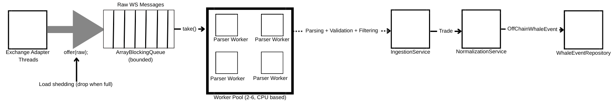

# Crypto Whale Tracker

**Crypto whale detection for on-chain and off-chain activity**

---

## Overview

Ingests:
- **Live exchange trades** via Exchange WebSockets (**10+**)
- **On-chain transactions** via [QuickNode](https://www.quicknode.com/?utm_term=quicknode&utm_campaign=Brand+-+Max+Conversions&utm_source=google&utm_medium=cpc&hsa_acc=1365030395&hsa_cam=20244916698&hsa_grp=150357053496&hsa_ad=692152634376&hsa_src=g&hsa_tgt=kwd-972169075647&hsa_kw=quicknode&hsa_mt=e&hsa_net=adwords&hsa_ver=3&gad_source=1&gad_campaignid=20244916698&gbraid=0AAAAADJZDIwyb-5KwHnJLvc5NVCHRVg3q&gclid=CjwKCAiA95fLBhBPEiwATXUsxD30-Mljz0jY4Zf_YBl_-0TCg2T75rDOo9R_KqSCM7sK8YwC2cemERoCa8YQAvD_BwE)

Incoming data is normalized, filtered, and analyzed in real time to detect high-value transfers and trades. Detected whale events are stored in bounded, thread-safe buffers and exposed through REST endpoints for dashboards, alerts, or downstream systems.

Whale detection thresholds used are from [Whale Alert](https://whale-alert.io/whales.html)

---

## Features

- Whale detection from exchange and on-chain data
- Normalized trade and transfer data across sources
- REST API for accessing recent whale activity

---

## Requirements

### QuickNode

**QuickNode** is used for on-chain data.

You will need to:
1. Create a QuickNode account  
2. Create the required **streams / endpoints** for the chains you want to monitor (if chain not included, include it within the **Asset** enumeration)  
3. Copy your QuickNode API key  

### Configuration

Save your QuickNode API key as an environment variable:

```bash
export QUICKNODE_API_KEY=your_key_here
```
This is referenced in the **application.yaml**

---

## Architecture (Off-Chain Ingestion)



High-level flow for exchange trade ingestion, parsing, normalization, and whale event storage.

---

## Technology

- Java 21
- Spring Boot
